# Plan de Entrega — SECOP Integrado

**Proyecto:** Base de datos relacional de contratación pública de Colombia (SECOP I + SECOP II) sobre datos abiertos oficiales.
**Volumetría:** **16.025.993 registros** en `bronze` → **13.005.402** en `silver` tras deduplicar · 16 columnas · base `secop_dw`.
**Motor:** PostgreSQL 18.6 + DBeaver 26.2.0 + Python 3.14 + Power BI Desktop.
**Equipo (3):** Kerin · José · Isabella
**Régimen de trabajo:** lunes y miércoles, en 6 sesiones, hasta la entrega del **miércoles 14 de octubre de 2026**.

---

## 1. Los 5 entregables

| # | Entregable | Rol | Persona | Documento donde se entrega |
|---|---|---|---|---|
| **1** | **Volumetría** | Analista de Datos | **Kerin** | [`docs/volumetria.md`](volumetria.md) ✅ |
| **2** | **Modelo lógico y conceptual de la bodega de datos** | Analista de Datos | **Kerin** | ✅ [`docs/modelo_relacional.md`](modelo_relacional.md) · [`sql/02_modelo_gold.sql`](../sql/02_modelo_gold.sql) |
| **3** | **Aplicación y explicación de la metodología Medallion** | ETL / Administrador de PostgreSQL | **José** | `docs/etl_carga.md` (sección Medallion) |
| **4** | **Explicación de los ETL** | ETL / Administrador de PostgreSQL | **José** | `docs/etl_carga.md` |
| **5** | **Fotos de las visualizaciones** | QA / Visualización | **Isabella** | [`docs/imagenes/`](/docs/imagenes/)✅ + `docs/visualizaciones.md` |

---

## 2. Roles y responsabilidades

| Miembro | **Rol** | Responsabilidad principal | Entregables | Requisitos asignados |
|---|---|---|---|---|
| **Kerin** | **Analista de Datos** | Medición y caracterización del dataset, modelo de la bodega, consultas analíticas de negocio | **1** y **2** | RF-07 a RF-13, RNF-05 a RNF-07 |
| **José** | **ETL / Administrador de PostgreSQL** | Descarga, carga, modelado físico, índices, particionado, tuning del servidor | **3** y **4** | RF-01 a RF-06, RNF-01 a RNF-04 |
| **Isabella** | **QA / Visualización** | Calidad de datos, validación de integridad, tableros en Power BI y evidencias gráficas | **5** | RF-14 a RF-20, RNF-08 a RNF-10 |

### 2.1 Nota sobre el rol de Kerin

Kerin **tiene asignada la volumetría como primera tarea técnica** (es el Entregable 1 y el primer punto solicitado del proyecto), pero **su rol no es "analista de volumetría"**: es **Analista de Datos**. La volumetría es la medición de entrada; a partir de ella Kerin construye el modelo de la bodega y las consultas analíticas, que es lo que define su rol.

### 2.2 Reparto de requerimientos (30 en total)

| Persona | Requisitos | Cantidad |
|---|---|---|
| **Kerin** | RF-07 … RF-13 · RNF-05 … RNF-07 | 7 + 3 = **10** |
| **José** | RF-01 … RF-06 · RNF-01 … RNF-04 | 6 + 4 = **10** |
| **Isabella** | RF-14 … RF-20 · RNF-08 … RNF-10 | 7 + 3 = **10** |

Detalle completo en [`requerimientos.md`](requerimientos.md).

---

## 3. Las 6 sesiones (lunes y miércoles)

> Calendario verificado: lunes 28/09, miércoles 30/09, lunes 05/10, miércoles 07/10, lunes 12/10, **miércoles 14/10 = entrega**.

### Sesión 1 · Lunes 28 de septiembre

| Quién | Actividades | Producto |
|---|---|---|
| **Kerin** | Medir volumetría de origen vía API Socrata: conteo real de filas, distribución por origen/año/departamento, nulos, cardinalidades, bytes por fila, perfil por columna. Redactar el documento | **`volumetria.md` v1** |
| **José** | Verificar entorno: PostgreSQL 18.6 activo en 5432, crear base de datos `secop_dw`, configurar DBeaver y la conexión | BD creada + conexión DBeaver |
| **Isabella** | Instalar/configurar Power BI Desktop, preparar el repo del proyecto, definir la lista de KPIs candidatos para el Entregable 5 | Power BI operativo + lista de KPIs |

**Horas:** Kerin 4 h · José 3 h · Isabella 3 h

### Sesión 2 · Miércoles 30 de septiembre

| Quién | Actividades | Producto |
|---|---|---|
| **Kerin** | Cerrar el entregable 1: proyección a PostgreSQL, plan de índices y particionado, riesgos de capacidad, anomalías volumétricas | **`volumetria.md` final** |
| **José** | Implementar la descarga paginada en paralelo y el script `cargar_postgres.py` con `COPY FROM STDIN` por lotes de 250.000 | Script funcionando + primeras filas cargadas |
| **Isabella** | Perfilado de columnas en DBeaver: tipos, nulos reales, valores más frecuentes. Contrastar contra la volumetría de Kerin | Reporte de perfilado |

**Horas:** Kerin 3 h · José 5 h · Isabella 3 h

### Sesión 3 · Lunes 5 de octubre

| Quién | Actividades | Producto |
|---|---|---|
| **Kerin** | **E2** · Modelo **conceptual**: entidades de negocio, cardinalidades, diagrama PlantUML | Diagrama conceptual |
| **José** | **E3** · Metodología Medallion: concepto de Bronze/Silver/Gold y su aplicación concreta a SECOP, con diagrama | Sección Medallion + diagrama |
| **Isabella** | Validación de integridad de carga: `count(*)` vs API, duplicados, proporción de nulos, verificación del grano | Reporte de integridad |

**Horas:** Kerin 4 h · José 4 h · Isabella 3 h

### Sesión 4 · Miércoles 7 de octubre

| Quién | Actividades | Producto |
|---|---|---|
| **Kerin** | **E2** · Modelo **lógico**: normalización 1FN/2FN/3FN, esquema en estrella con PK/FK, DDL de las 7 dimensiones + fact | Diagrama lógico + DDL |
| **José** | **E4** · ETL parte 1: mapeo de tipos, descarga → `COPY`, normalización de fechas, función `es_fecha_valida()` | `etl_carga.md` v1 |
| **Isabella** | **E5** · Power BI parte 1: conexión al modelo, página de KPIs globales y evolución anual | Páginas 1–2 del tablero |

**Horas:** Kerin 4 h · José 5 h · Isabella 4 h

### Sesión 5 · Lunes 12 de octubre

| Quién | Actividades | Producto |
|---|---|---|
| **Kerin** | Consultas analíticas de negocio (RF-07 a RF-13): concentración, fraccionamiento, regiones, tiempos de ejecución. Vistas reutilizables | `consultas_ejemplos.md` |
| **José** | **E3 + E4** cierre: índices finales, particionado por año, `VACUUM ANALYZE`, tuning de `postgresql.conf`. Medir la volumetría real y reemplazar las estimaciones | `etl_carga.md` final + `volumetria.md` §6 con cifras reales |
| **Isabella** | **E5** · Power BI parte 2: mapa por departamento, top contratistas, tabla de filtros interactivos | Páginas 3–5 del tablero |

**Horas:** Kerin 4 h · José 4 h · Isabella 4 h

### Sesión 6 · Miércoles 14 de octubre · **ENTREGA**

| Quién | Actividades | Producto |
|---|---|---|
| **Kerin** | Checklist final de los 5 entregables, revisión cruzada, homogenousar nombres fact/dim entre modelo, vistas y tablero | Checklist OK |
| **José** | Verificación de reproducibilidad: el README permite a un tercero montar todo desde cero | Checklist OK |
| **Isabella** | **E5** · Capturas PNG de todas las páginas del tablero en alta resolución, nombradas y ordenadas en `docs/imagenes/` | **Fotos de las visualizaciones** |

**Horas:** Kerin 3 h · José 3 h · Isabella 4 h

### 3.1 Resumen de horas por persona

| Persona | S1 28/09 | S2 30/09 | S3 05/10 | S4 07/10 | S5 12/10 | S6 14/10 | **Total** |
|---|---:|---:|---:|---:|---:|---:|---:|
| **Kerin** | 4 | 3 | 4 | 4 | 4 | 3 | **22 h** |
| **José** | 3 | 5 | 4 | 5 | 4 | 3 | **24 h** |
| **Isabella** | 3 | 3 | 3 | 4 | 4 | 4 | **21 h** |

---

## 4. Ceremonias del sprint

| Ceremonia | Sesión | Hora | Duración |
|---|---|---|---|
| Sprint Planning + Kickoff | S1 · Lun 28/09 | 09:00 | 45 min |
| Daily Standup | S2 → S5 | 09:00 | 15 min |
| Revisión de volumetría (control de calidad) | S2 · Mié 30/09 | 13:00 | 30 min |
| Revisión cruzada (Pull Request) | S5 · Lun 12/10 | 13:00 | 45 min |
| Sprint Review | S6 · Mié 14/10 | 09:00 | 30 min |
| Sprint Retrospective | S6 · Mié 14/10 | 09:30 | 30 min |
| **ENTREGA FINAL** | **S6 · Mié 14/10** | **11:00** | — |

### 4.1 Backlog priorizado

| Prio | Ítem | Dueño | Talla | Definición de "hecho" |
|---|---|---|---|---|
| **P0** | Volumetría completa | Kerin | L | Las 12 secciones escritas, con 4 proyecciones a PostgreSQL y las consultas SQL de verificación |
| **P0** | Descarga por años + carga | José | L | 16.025.993 filas en `bronze`, `count(*)` = 16.025.993 |
| **P0** | Modelo conceptual y lógico | Kerin | L | 2 diagramas PlantUML + DDL con PK/FK de 7 dimensiones + fact |
| **P0** | Metodología Medallion | José | M | Bronze/Silver/Gold explicados y aplicados a SECOP, con diagrama |
| **P0** | Explicación de los ETL | José | L | Mapeo de tipos, `COPY` por lotes, normalización de fechas, índices y particionado documentados |
| **P0** | Fotos de las visualizaciones | Isabella | M | ≥ 5 capturas PNG de alta resolución en `docs/imagenes/` |
| **P0** | Revisión cruzada + entrega | Equipo | S | Los 3 aprueban y el repo queda actualizado |
| **P1** | Consultas analíticas | Kerin | M | ≥ 15 consultas de negocio, cada una < 5 s |
| **P1** | Tablero Power BI | Isabella | L | 5 páginas: KPIs, evolución, mapa, top contratistas, filtros |
| **P1** | Calidad de datos | Isabella | M | `calidad_datos.md` con las 4 clases de anomalías medidas |
| **P2** | Particionado por año | José | M | 30 particiones funcionando, consultas anuales < 1 s |
| **P2** | Diccionario de datos | Kerin | S | 22 columnas con tipo, descripción, nulos y ejemplo |

---

## 5. Diagrama Gantt del sprint

```plantuml
@startgantt
title Sprint SECOP · 6 sesiones (lunes y miércoles) · entrega 14/10/2026
Project starts 2026-09-28
Project ends 2026-10-15

' ===== CEREMONIAS (equipo) =====
[Sprint Planning + Kickoff] as [C1] lasts 1 day
[C1] starts 2026-09-28
[C1] #FFF59D

[Daily Standup 30/09] as [C2] lasts 1 hour
[C2] starts 2026-09-30
[C2] #FFF59D

[Daily Standup 05/10] as [C3] lasts 1 hour
[C3] starts 2026-10-05
[C3] #FFF59D

[Daily Standup 07/10] as [C4] lasts 1 hour
[C4] starts 2026-10-07
[C4] #FFF59D

[Daily Standup 12/10] as [C5] lasts 1 hour
[C5] starts 2026-10-12
[C5] #FFF59D

[Revisión de volumetría 30/09] as [CV] lasts 1 hour
[CV] starts 2026-09-30
[CV] #FFE082

[Revisión cruzada PR 12/10] as [CR] lasts 1 hour
[CR] starts 2026-10-12
[CR] #FFE082

[Sprint Review + Retrospective] as [CR2] lasts 1 day
[CR2] starts 2026-10-14
[CR2] #FFF59D

' ===== KERIN · Entregables 1 y 2 (verde) =====
[E1 Volumetría: medir vía API] as [K1] lasts 2 days
[K1] starts 2026-09-28
[K1] ends 2026-09-29
[K1] #C8E6C9

[E1 Volumetría: proyección PG + índices] as [K2] lasts 1 day
[K2] starts 2026-09-30
[K2] #C8E6C9

[E2 Modelo conceptual] as [K3] lasts 1 day
[K3] starts 2026-10-05
[K3] #C8E6C9

[E2 Modelo lógico + DDL] as [K4] lasts 1 day
[K4] starts 2026-10-07
[K4] #C8E6C9

[Consultas analíticas de negocio] as [K5] lasts 1 day
[K5] starts 2026-10-12
[K5] #C8E6C9

[Checklist + revisión cruzada] as [K6] lasts 1 day
[K6] starts 2026-10-14
[K6] #C8E6C9

' ===== JOSE · Entregables 3 y 4 (azul) =====
[Entorno: crear BD + conexión DBeaver] as [J1] lasts 1 day
[J1] starts 2026-09-28
[J1] #AADDF7

[Descarga paginada + COPY por lotes] as [J2] lasts 2 days
[J2] starts 2026-09-29
[J2] ends 2026-09-30
[J2] #AADDF7

[E3 Metodología Medallion] as [J3] lasts 1 day
[J3] starts 2026-10-05
[J3] #AADDF7

[E4 ETL: tipos + fechas + COPY] as [J4] lasts 1 day
[J4] starts 2026-10-07
[J4] #AADDF7

[E3+E4 cierre: índices + particionado + tuning] as [J5] lasts 1 day
[J5] starts 2026-10-12
[J5] #AADDF7

[Verificación de reproducibilidad] as [J6] lasts 1 day
[J6] starts 2026-10-14
[J6] #AADDF7

' ===== ISABELLA · Entregable 5 (rosa) =====
[Power BI: instalar + KPIs candidatos] as [I1] lasts 1 day
[I1] starts 2026-09-28
[I1] #F8BBD0

[Perfilado de columnas en DBeaver] as [I2] lasts 1 day
[I2] starts 2026-09-30
[I2] #F8BBD0

[Validación de integridad de carga] as [I3] lasts 1 day
[I3] starts 2026-10-05
[I3] #F8BBD0

[E5 Power BI: KPIs + evolución] as [I4] lasts 1 day
[I4] starts 2026-10-07
[I4] #F8BBD0

[E5 Power BI: mapa + top + filtros] as [I5] lasts 1 day
[I5] starts 2026-10-12
[I5] #F8BBD0

[E5 Capturas PNG de las visualizaciones] as [I6] lasts 1 day
[I6] starts 2026-10-14
[I6] #F8BBD0

' ===== HITOS =====
[Sprint Backlog definido] happens 2026-09-28
[E1 Volumetría entregada] happens 2026-09-30
[22,67M filas cargadas en PostgreSQL] happens 2026-10-05
[E2 Modelo completo] happens 2026-10-07
[E3 Medallion + E4 ETL cerrados] happens 2026-10-12
[ENTREGA FINAL] happens 2026-10-14
@endgantt
```

**Leyenda de colores:** amarillo = ceremonias Scrum (equipo) · naranja = revisiones · **verde = Kerin (Analista de Datos, Entregables 1 y 2)** · **azul = José (ETL / Admin PostgreSQL, Entregables 3 y 4)** · **rosa = Isabella (QA / Visualización, Entregable 5)**.

---

## 6. Metodología Medallion aplicada a SECOP (resumen del Entregable 3)

> El desarrollo completo lo hace **José** en `etl_carga.md`. Aquí queda la definición acordada por el equipo.

```plantuml
@startuml
skinparam componentStyle rectangle
title Arquitectura Medallion - SECOP Integrado
left to right direction

package "BRONZE - Ingesta cruda" {
  [API Socrata rpmr-utcd\ncontratos 2017-2026]
  [Descarga paginada por año\n10 CSV, uno por año]
  [bronze.secop_raw\n16 columnas text\n16.025.993 filas]
}

package "SILVER - Limpieza y normalizacion" {
  [silver.contratos\ntipos nativos + R1-R9\n13.005.402 filas]
  [R1-R3: texto, nulos falsos\ny homologacion de nombres]
  [R4: fechas imposibles\na NULL + bandera]
  [R5: duplicados exactos\nBORRADOS (unica regla destructiva)]
  [R7b: valor_ajustado\nreparte versiones]
  [R9-R9b: atipicos\nmarcados, no borrados]
}

package "GOLD - Modelo analitico" {
  [fact_contrato particionado\npor ano (13 particiones)]
  [dim_entidad · dim_proveedor]
  [dim_tipo_contrato · dim_modalidad]
  [dim_estado · dim_origen]
  [dim_tiempo 1900-2030\nclave natural, sin -1]
  [v_contratos · v_contratos_validos\npara Power BI]
}

[API Socrata rpmr-utcd\ncontratos 2017-2026] --> [Descarga paginada por ano\n10 CSV, uno por ano]
[Descarga paginada por ano\n10 CSV, uno por ano] --> [bronze.secop_raw\n16 columnas text\n16.025.993 filas]
[bronze.secop_raw\n16 columnas text\n16.025.993 filas] --> [silver.contratos\ntipos nativos + R1-R9\n13.005.402 filas]
[silver.contratos\ntipos nativos + R1-R9\n13.005.402 filas] --> [R1-R3: texto, nulos falsos\ny homologacion de nombres]
[silver.contratos\ntipos nativos + R1-R9\n13.005.402 filas] --> [R4: fechas imposibles\na NULL + bandera]
[silver.contratos\ntipos nativos + R1-R9\n13.005.402 filas] --> [R5: duplicados exactos\nBORRADOS (unica regla destructiva)]
[silver.contratos\ntipos nativos + R1-R9\n13.005.402 filas] --> [R7b: valor_ajustado\nreparte versiones]
[silver.contratos\ntipos nativos + R1-R9\n13.005.402 filas] --> [R9-R9b: atipicos\nmarcados, no borrados]
[R4: fechas imposibles\na NULL + bandera] --> [fact_contrato particionado\npor ano (13 particiones)]
[R7b: valor_ajustado\nreparte versiones] --> [dim_entidad · dim_proveedor]
[R5: duplicados exactos\nBORRADOS (unica regla destructiva)] --> [dim_tipo_contrato · dim_modalidad]
[R1-R3: texto, nulos falsos\ny homologacion de nombres] --> [dim_estado · dim_origen]
[R5: duplicados exactos\nBORRADOS (unica regla destructiva)] --> [dim_tiempo 1900-2030\nclave natural, sin -1]
[R9-R9b: atipicos\nmarcados, no borrados] --> [v_contratos · v_contratos_validos\npara Power BI]
[dim_tipo_contrato · dim_modalidad] --> [v_contratos · v_contratos_validos\npara Power BI]
[dim_estado · dim_origen] --> [v_contratos · v_contratos_validos\npara Power BI]
@enduml```

**Definición de cada capa para SECOP:**

| Capa | Qué es | Tamaño estimado | Quién la construye |
|---|---|---:|---|
| **Bronze** | Copia cruda de la API de Socrata, 22 columnas `text`, sin transformar | ~18,7 GiB | José (script de carga) |
| **Silver** | Tipos nativos de PostgreSQL, fechas validadas, dimensiones tipificadas y normalizadas, duplicados **marcados** | ~14 GiB | José (ETL) |
| **Gold** | Esquema en estrella con PK/FK, `fact_contrato` particionado por año y vistas de negocio | ~11 – 13 GiB | Kerin (modelo) + José (DDL) |

**Regla de oro del proyecto:** Bronze nunca se reescribe, Silver normaliza, Gold modela. Cada transformación es reproducible desde Bronze.

---

## 7. Modelo conceptual de la bodega (resumen del Entregable 2)

> Desarrollo completo de **Kerin** en `modelo_relacional.md`. Definición conceptual acordada:

```plantuml
@startuml
title Modelo conceptual - entidades de negocio del SECOP
left to right direction

class ENTIDAD
class CONTRATO
class PROVEEDOR
class TIPO_CONTRATO
class MODALIDAD
class ESTADO
class ORIGEN
class TIEMPO

ENTIDAD "1" -- "*" CONTRATO : convoca (codigo_entidad)
PROVEEDOR "1" -- "*" CONTRATO : ejecuta (documento_proveedor)
TIPO_CONTRATO "1" -- "*" CONTRATO : clasifica
MODALIDAD "1" -- "*" CONTRATO : define vía de contratación
ESTADO "1" -- "*" CONTRATO : ciclo de vida
ORIGEN "1" -- "*" CONTRATO : plataforma que lo publicó
TIEMPO "1" -- "*" CONTRATO : firma / inicia / termina

note right of ENTIDAD : ubicacion (departamento, municipio)
note right of PROVEEDOR : tipo de documento
@enduml
```



**Grano de la entidad `CONTRATO`:** una fila = **una versión de contrato**, es decir, una de las 13.005.402 filas de `silver.contratos`. SECOP II publica cada modificación como una fila nueva, así que un contrato con tres modificaciones aparece tres veces; eso es lo que permite analizar el fraccionamiento (RF-08). Los duplicados **exactos** se eliminan en plata (regla R5): 16.025.993 → 13.005.402.

**Desviación de la especificación:** se pedían 9 dimensiones y el modelo tiene 7. `dim_ubicacion` y `dim_tipo_documento` se eliminaron porque sus atributos ya viven en `dim_entidad` y `dim_proveedor`; `dim_tiempo` quedó sin llave sustituta porque la clave de partición debe ser columna de la propia tabla. Los cuatro detalles están justificados en `decisiones_tecnicas.md` §2, §3 y §15.

---

## 8. Checklist final de la entrega (miércoles 14/10)

- [x] **E1 · Volumetría** — medición del corte vigente, con los puntos no medidos marcados como pendientes y su consulta.
- [x] **E2 · Modelo** — diagrama conceptual + diagrama lógico en PlantUML, normalización 1FN/2FN/3FN explicada, DDL de las 7 dimensiones + `fact_contrato` con PK/FK.
- [x] **E3 · Medallion** — Bronze/Silver/Gold explicados **y aplicados a SECOP**, con diagrama de arquitectura.
- [x] **E4 · ETL** — descarga por años, `COPY FROM STDIN` por lotes, mapeo de tipos, saneamiento de fechas, normalización de categorías, índices y particionado.
- [ ] **E5 · Fotos** — ≥ 5 capturas PNG de alta resolución en `docs/imagenes/`, referenciadas desde el documento de visualizaciones.
- [ ] `docs/requerimientos.md` con los 30 requisitos y su responsable asignado.
- [ ] Revisión cruzada de los 3 miembros (comentada en el repositorio).
- [ ] `README.md` permite a un tercero montar el entorno completo desde cero.
- [ ] Commit final y entrega el **miércoles 14/10 a las 11:00**.

---

## 9. Referencias

| Documento | Contenido | Estado |
|---|---|---|
| [volumetria.md](volumetria.md) | **Entregable 1** — volumetría medida del dataset y proyección a PostgreSQL | ✅ Completo |
| [requerimientos.md](requerimientos.md) | 20 RF + 10 RNF con responsable asignado | ✅ Completo |
| [README.md](README.md) | Índice de la documentación técnica | Pendiente |
| modelo_relacional.md | Entregable 2 | ✅ Completo (Kerin) |
| etl_carga.md | Entregables 3 y 4 | Pendiente (José) |
| visualizaciones.md + imagenes/ | Entregable 5 | Pendiente (Isabella) |
| calidad_datos.md | Anomalías de la volumetría §8 desarrolladas | Pendiente (Isabella) |
| diccionario_datos.md | Las 22 columnas en detalle | Pendiente (Kerin) |
| consultas_ejemplos.md | Consultas analíticas de negocio | Pendiente (Kerin) |
| instalacion-postgresql-dbeaver.md | Montaje del entorno | Pendiente (José) |
| glosario.md | Modalidades, mínima cuantía, régimen especial | Pendiente (Kerin) |
| decisiones_tecnicas.md | ADR de particionado, BRIN, `dim_tiempo` y el `-1` | ✅ Completo (Kerin) |
| bitacora_sesiones.md | Qué se hizo en cada lunes/miércoles | Pendiente (Kerin) |
