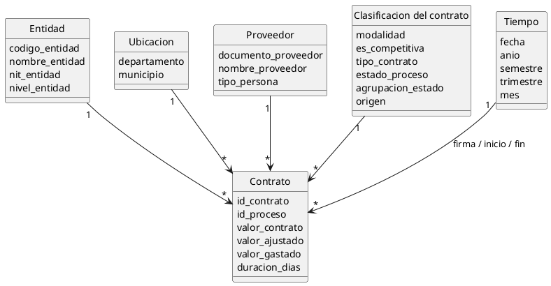
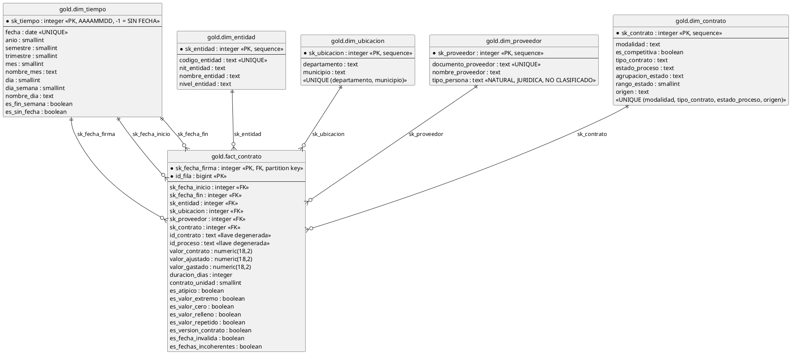

# Modelo relacional — Entregable 2

**Responsable:** Kerin · **Requerimientos:** RQ01-RQ14, RF-06 (modelo en estrella con PK y FK), RF-07 a RF-13, RF-21, RF-22, RNF-04, RNF-05, RNF-06
**Base de datos:** `secop_dw` · **DDL ejecutable:** [`sql/02_modelo_gold.sql`](../sql/02_modelo_gold.sql)

Este documento describe el modelo **conceptual** (qué información existe y cómo se relaciona) y el **lógico** (tablas, columnas, tipos, claves y restricciones). El modelo físico está en el DDL; este documento lo explica y lo justifica, no lo duplica.

---

## 1. Cómo leer las cifras de este documento

| Marca | Significado |
|---|---|
| **medido** | Salió de una consulta sobre el corte vigente (`secop_dw`, 29/09/2026) |
| **definido** | Es una regla de negocio del proyecto, no una medición |
| **pendiente** | No medido todavía |

Corte vigente: 16.025.993 filas en bronce, **13.005.402** en plata y **13.005.402** en `fact_contrato` (medido: diferencia 0). Las cifras del corte anterior (`secop_integrado`, 22.670.028 filas) **no son válidas** aquí.

---

## 2. El modelo sale de los requerimientos

**Corrección del profesor:** el modelo estrella se crea a partir de los requerimientos. Cada dimensión existe porque algún RQ la necesita:

| RQ | Se responde con |
|---|---|
| RQ01 valor y número de contratos por entidad y año | `dim_entidad` + `dim_tiempo` |
| RQ02 evolución anual 2017-2026 | `dim_tiempo` (año) |
| RQ03 porcentaje de contratación directa por entidad | `dim_entidad` + `es_competitiva` de `dim_contrato` |
| RQ04 concentración de proveedores y entidades con las que contratan | `dim_proveedor` y `COUNT(DISTINCT sk_entidad)` |
| RQ05 departamentos y municipios con mayor valor | `dim_ubicacion` |
| RQ06 duración promedio por tipo y modalidad | `duracion_dias` + `dim_contrato` |
| RQ07 nacional frente a territorial | `nivel_entidad` de `dim_entidad` |
| RQ08 valor total y promedio por tipo | `tipo_contrato` de `dim_contrato` |
| RQ09 estacionalidad mensual y trimestral | mes y trimestre de `dim_tiempo` |
| RQ10 proporción de valor con personas naturales y jurídicas | `tipo_persona` de `dim_proveedor` |
| RQ11 participación de SECOP II frente a SECOP I | `origen` de `dim_contrato` |
| RQ12 entidades con más contratos atípicos | `es_atipico` por `dim_entidad` |
| RQ13 estado de los contratos | `agrupacion_estado` de `dim_contrato` |
| RQ14 valor gastado | medida `valor_gastado` |

---

## 3. La capa de entrada: qué hereda la capa oro

Oro no limpia nada: toma `silver.contratos` y reorganiza la información en estrella. El trabajo de calidad ya ocurrió en plata:

| Decisión de plata | Efecto en oro |
|---|---|
| Elimina duplicados exactos (16.025.993 → 13.005.402) | `fact_contrato` tiene una fila por versión, no por registro bruto |
| Calcula `valor_ajustado` por versiones | `SUM(valor_ajustado)` es correcto; `SUM(valor_contrato)` no |
| Normaliza mayúsculas, tildes y barras (R1, R3) | Las claves naturales admiten `UNIQUE` plano |
| Pone fechas imposibles en `NULL` con bandera (R4) | Las filas sin fecha caen en el registro `-1 SIN FECHA` |
| Marca valores extremos con `flag_valor_atipico` | Todo KPI de dinero filtra `NOT es_atipico` |

Las banderas **viajan a oro** sin el prefijo `flag_` (`es_atipico`, `es_valor_extremo`, `es_valor_cero`, `es_valor_relleno`, `es_valor_repetido`, `es_version_contrato`, `es_fecha_invalida`, `es_fechas_incoherentes`).

---

## 4. El grano

**Una fila de `gold.fact_contrato` = una fila de `silver.contratos` = una versión de contrato.**

No es un contrato ni un registro del CSV. Dos razones:

1. **SECOP II publica cada modificación como una fila nueva.** En el corte vigente hay **554.063 contratos con versiones** (medido) y **12.147.523 `id_contrato` distintos** en las 13.005.402 filas (medido).
2. **Por eso `SUM(valor_ajustado)` funciona y `SUM(valor_contrato)` no.** Sumar el valor crudo suma cada versión completa y multiplica el dinero (692 billones en 2018 frente a ~100 oficiales).

Si el grano subiera a «contrato» habría que elegir una fila por contrato y se perdería la historia de modificaciones.

> **La diapositiva 9 debe corregirse:** dice «`id_contrato` + `documento_proveedor`», y el grano real es **una versión de contrato**.

---

## 5. Modelo conceptual

### 5.1 Entidades

| Entidad | Atributos |
|---|---|
| **Contrato** (hecho) | fechas de firma, inicio y fin; `id_contrato`; `id_proceso`; `valor_contrato`; `valor_ajustado`; `valor_gastado`; `duracion_dias`; banderas de calidad |
| **Entidad contratante** | código, nombre, NIT, nivel |
| **Ubicación** | departamento, municipio |
| **Proveedor** | documento, nombre, tipo de persona |
| **Clasificación del contrato** | modalidad, es competitiva, tipo, estado, agrupación de estado, origen |
| **Tiempo** | fecha, año, semestre, trimestre, mes, día |

### 5.2 Relaciones

| Desde | Hacia | Cardinalidad |
|---|---|---|
| Entidad | Contrato | 1 → N |
| Ubicación | Contrato | 1 → N |
| Proveedor | Contrato | 1 → N |
| Clasificación | Contrato | 1 → N |
| Tiempo | Contrato | 1 → N, **tres veces** (firma, inicio, fin) |

**No existe relación entre dimensiones.** Es lo que hace que sea una estrella y no un grafo.

### 5.3 Diagrama conceptual



### 5.4 Ubicación: dimensión propia

`dim_ubicacion` es una dimensión separada de `dim_entidad` porque RQ05 es un requerimiento geográfico en sí mismo. La ubicación es **la de la entidad contratante**; la fuente no trae lugar de ejecución. Detalle y alternativa descartada en `decisiones_tecnicas.md` §3.1.

---

## 6. Modelo lógico

### 6.1 Diagrama lógico



### 6.2 Tabla de hechos: clave, medida o atributo

| Categoría | Columnas | Uso |
|---|---|---|
| **Claves** | `sk_fecha_firma` + `id_fila` (PK compuesta); `sk_fecha_inicio`, `sk_fecha_fin`, `sk_entidad`, `sk_ubicacion`, `sk_proveedor`, `sk_contrato` | Unen el hecho con las dimensiones. No se agregan |
| **Llaves degeneradas** | `id_contrato`, `id_proceso` | Agrupan versiones y permiten bajar al detalle. Sin dimensión propia (`decisiones_tecnicas.md` §4) |
| **Medidas aditivas** | `valor_ajustado`, `valor_gastado`, `contrato_unidad` | Se suman |
| **Medida no aditiva** | `valor_contrato` | Se conserva por fidelidad; **no se suma** |
| **Medida semi-aditiva** | `duracion_dias` | Se promedia o se calculan percentiles; sumarla no tiene sentido |
| **Atributos del hecho** | las 8 banderas | Describen esta versión; se filtran o cuentan |

Medidas **derivadas** que no se almacenan (se calculan en las vistas): valor promedio, porcentaje no competitivo, participación de SECOP II, porcentaje de valor atípico.

### 6.3 Medidas

| Medida | Definición | Tipo |
|---|---|---|
| `valor_ajustado` | `valor_contrato / n`, con `n` filas del mismo contrato (R7 y R7b). **La que se suma** | definida |
| `valor_gastado` | = `valor_ajustado` si `NOT es_atipico` y `agrupacion_estado` ∉ {PRECONTRACTUAL, CANCELADO, NO REGISTRA}; en otro caso **0** | **definida**, pendiente de confirmar con el profesor |
| `duracion_dias` | `fecha_fin − fecha_inicio`; NULL si falta una de las dos | calculada en la carga |
| `contrato_unidad` | 1 en cada fila | constante |

**`valor_gastado` es el valor contratado vigente, no el pagado.** La fuente no trae valor pagado ni ejecutado. Nunca debe presentarse como dinero pagado.

---

## 7. Dimensiones

### 7.1 `dim_tiempo`

Calendario **2000-01-01 a 2060-12-31** (22.281 días) más el registro `-1 SIN FECHA`: **22.282 filas** (medido, verificación 9.12 en `t`). Clave entera `sk_tiempo` = AAAAMMDD.

Se usa con **tres roles** en el hecho (firma, inicio y fin). El entero sirve como clave de partición, lo que invalida la justificación anterior de usar la fecha como clave natural (`decisiones_tecnicas.md` §5).

### 7.2 `dim_entidad` y `dim_ubicacion`

`dim_entidad`: clave natural `codigo_entidad` (el NIT tiene 4,00 % de vacíos). **15.821 entidades** nuevas más el `-1` (medido). La ubicación **no** vive aquí.

`dim_ubicacion`: un par `(departamento, municipio)`; los `NULL` se guardan como `NO REGISTRA`. **1.176 pares** nuevos más el `-1` (medido).

### 7.3 `dim_proveedor` y `tipo_persona`

Clave natural `documento_proveedor` (ya normalizado en plata, R8). **2.181.587 filas** incluido el `-1` (medido, conteo real).

`tipo_persona` es una **regla de negocio** (`gold.clasificar_persona`), asignada **por documento**: si un mismo documento aparece con tipos distintos, **JURIDICA gana sobre NATURAL, y NATURAL sobre NO CLASIFICADO**. El tipo de documento original **no se modela**.

**Medido:** 83.765 documentos tienen tipos contradictorios (2.554.879 filas, 19,6 %). Reparto resultante por fila de `fact_contrato`:

| tipo_persona | Filas |
|---|---:|
| NATURAL | 9.979.286 |
| JURIDICA | 2.903.235 |
| NO CLASIFICADO | 122.881 |
| **Total** | **13.005.402** |

Clasificando cada fila por separado salía NATURAL 10.372.323, JURIDICA 1.909.481 y NO CLASIFICADO 723.598; la diferencia es el efecto de asignar un tipo único a cada documento. **Riesgo:** como JURIDICA gana, un único `NIT` mal registrado puede inflarla. La proporción de RQ10 debe presentarse como **por documento y con prioridad JURIDICA**.

La clasificación del `NIT` genérico usa una **heurística** (9 dígitos que empiezan por 8 o 9 → JURIDICA), que cubre el 94,5 % de los 262.530 `NIT` genéricos (medido). La regla completa está en `requerimientos.md` RF-12.

### 7.4 `dim_contrato`

Combina modalidad, tipo de contrato, estado y origen: **1.005 combinaciones** nuevas más el `-1` (medido). Atributos derivados (**definidos**):

- **`es_competitiva`:** FALSE para `CONTRATACION DIRECTA`, `OTRAS FORMAS DE CONTRATACION DIRECTA` y `REGIMEN ESPECIAL`; TRUE para el resto; NULL si la modalidad es desconocida. **El régimen especial cuenta como no competitivo** (decisión del grupo). Resultado medido: ≈ 89,7 % de las filas son no competitivas, por lo que el indicador debe mostrarse **desglosado por modalidad**.
- **`agrupacion_estado` y `rango_estado`:** ciclo de vida en 7 grupos (1 PRECONTRACTUAL … 7 CANCELADO; 0 desconocido). **Regla provisional**; el orden de SUSPENDIDO y CEDIDO es juicio del equipo. El estado «ANULADO» **no existe** en la fuente: lo más cercano son 84 filas de cancelaciones (0,0006 %).

`origen` conserva `SECOPI` y `SECOPII` separados, porque usan vocabularios de estado distintos.

### 7.5 El registro `-1`

Las 5 dimensiones tienen un registro `sk = -1` (`NO REGISTRA`; `SIN FECHA` en tiempo). Razones:

1. Las FK del hecho son `NOT NULL`; sin el `-1`, la carga fallaría en la primera fila sin categoría.
2. Evita el `LEFT JOIN` + `COALESCE` en cada consulta.
3. Hace visible el vacío: contar filas con `sk_entidad = -1` responde «¿cuántos contratos no tienen entidad?» con un `WHERE`.

El `-1` **no se excluye** de los agregados generales (el total del tablero debe cuadrar con las filas de plata); solo se excluye cuando la pregunta es sobre entidades o proveedores.

---

## 8. Normalización

### 8.1 Primera forma normal

Se cumple. El origen tenía grupos repetidos de hecho físico: cada registro traía nombre de entidad, NIT, departamento y municipio, repetidos en miles de filas. Oro los extrae a dimensiones y cada fila de hechos guarda solo enteros.

### 8.2 Segunda y tercera forma normal

- **Dependencias parciales:** ninguna. Toda columna no clave depende de la clave completa.
- **`dim_entidad`, `dim_ubicacion`, `dim_proveedor`:** cumplen 3FN. Cada atributo depende de la clave sustituta y, equivalentemente, de la clave natural.
- **`dim_contrato` no cumple 3FN, y es deliberado.** `es_competitiva` depende de `modalidad`, y `agrupacion_estado` y `rango_estado` dependen de `estado_proceso`: son dependencias entre atributos no clave. Es la práctica habitual en una dimensión de un esquema en estrella: los atributos derivados se guardan ya calculados para agrupar sin funciones. Se recalculan con un `UPDATE` al cierre de la carga de dimensiones, así que no se desincronizan.
- **La tabla de hechos** guarda tres valores derivados (`valor_gastado`, `duracion_dias`, `contrato_unidad`). Son una **desnormalización de consumo** y se calculan solo en la carga. Por eso los hechos **no se corrigen en sitio**: se reconstruye oro.

### 8.3 Lo que ya no se desnormaliza

El modelo anterior guardaba `contratos` y `valor_total` en cada dimensión. **Se eliminaron**: eran derivables, podían quedar desactualizadas y obligaban a seis `UPDATE` por carga. Los agregados viven ahora en las vistas materializadas (`decisiones_tecnicas.md` §13).

---

## 9. Modelo físico: particionado e índices

Detalle en [`decisiones_tecnicas.md`](decisiones_tecnicas.md) §10 y §12. Resumen:

- **`fact_contrato` particionada por RANGE sobre `sk_fecha_firma`** (entero AAAAMMDD): `pre2017` (incluye el `-1`), 11 anuales 2017-2027 y una por defecto: **13 particiones**, todas en `gold` (medido, verificación 9.4).
- **PK compuesta** `(sk_fecha_firma, id_fila)`: PostgreSQL no admite una PK que no incluya la clave de partición.
- **7 índices adicionales:** BRIN sobre `sk_fecha_firma`; `(sk_fecha_firma, valor_ajustado)`; `sk_proveedor`; `sk_entidad`; `sk_ubicacion`; `sk_contrato`; `id_contrato`.
- Añadir 2028 requiere una sola partición nueva (RNF-04).

---

## 10. Trazabilidad (RNF-06)

`fact_contrato.id_fila` es la misma clave que `silver.contratos.id_fila` y `bronze.secop_raw.id_fila`:

```sql
SELECT ... FROM gold.fact_contrato f
JOIN silver.contratos  s USING (id_fila)
JOIN bronze.secop_raw  b USING (id_fila);
```

**Precio:** el `id` queda ligado al orden de carga de bronce; si bronce se recarga con otro orden, hay que reconstruir oro. Oro tampoco guarda `fecha_firma_original`: plata borró el texto de la fecha rechazada (R4), y se recupera por `id_fila` en bronce.

---

## 11. Vistas de consumo (RF-13)

| Vista | Para qué | Filtra |
|---|---|---|
| `gold.v_contratos` | Auditoría y QA. Todas las versiones con las banderas a la vista | Nada |
| `gold.v_contratos_validos` | **Origen único de Power BI** | `NOT es_atipico AND NOT es_fecha_invalida AND sk_fecha_firma <> -1` |

**Por qué el filtro vive en la vista:** un filtro de Power BI se desactiva con un clic. Si la vista ya viene filtrada, el tablero no puede mostrar un total contaminado.

Las vistas de agregación para el tablero (KPIs, evolución, geografía, proveedores, calidad) están en `sql/04_vistas.sql` y se refrescan con `CALL gold.refrescar_vistas()`. **Pendiente de actualizar** al modelo de 5 dimensiones.

---

## 12. Verificación

El bloque 9 del DDL ejecuta 17 comprobaciones. Resultado de la carga de prueba (medido):

| # | Comprobación | Esperado | Resultado |
|---|---|---|---|
| 9.1 | Objetos de oro (5 dimensiones + 1 hecho) | 6 | ✔ |
| 9.3 / 9.4 | Particiones, todas en `gold` | 13 | ✔ |
| 9.5 | Huérfanos por FK (7 conteos) | 0 | ✔ |
| 9.6 | `silver` − `fact_contrato` | 0 | ✔ (13.005.402 = 13.005.402) |
| 9.7 | `(sk_fecha_firma, id_fila)` duplicados | 0 | ✔ |
| 9.8 | Filas en `-1` | Coincide con los vacíos de plata | ✔ |
| 9.9 | Dinero 2018, sin atípicos | ≈ 100 billones | ✔ **102,54**; `gastado` ≤ `limpio` |
| 9.11 | Atípicos | 33.938 | ✔ |
| 9.12 | `dim_tiempo` | 22.282 filas, sin huecos | ✔ |
| 9.13 | `tipo_persona` por fila | 9.979.286 / 2.903.235 / 122.881 | ✔ (ver §7.3) |
| 9.14 | Estados sin agrupar | 0 filas | ✔ |
| 9.16 | `valor_gastado` > `valor_ajustado` | 0 | ✔ |
| 9.17 | `secop_lectura` | ve `gold`, no ve `silver` | ✔ |

> **Esta carga es de prueba.** Cuando se corrija la regla R5 de plata (conservar el estado de mayor rango, `decisiones_tecnicas.md` §18), habrá que **repetir la carga de oro**. El conteo no cambia, pero cambia el estado que conserva cada fila y, con ello, `valor_gastado` y la verificación 9.15.

La verificación 9.9 es la que importa: un modelo perfectamente normalizado que suma mal es peor que uno mal normalizado que al menos se ve raro.

---

## 13. Trazabilidad de requisitos

| Requisito | Dónde se cumple |
|---|---|
| RQ01-RQ14 | Sección 2 |
| RF-06 · Modelo en estrella con PK y FK | Secciones 6-9, DDL completo |
| RF-07 · Concentración y distribución | `dim_proveedor`, `dim_entidad`, `dim_contrato` |
| RF-08 · Contratación no competitiva | `es_competitiva` (§7.4) |
| RF-09 · Duración | `duracion_dias`, `es_fechas_incoherentes` |
| RF-10 · Evolución y estacionalidad | `dim_tiempo`, `origen` |
| RF-11 · Geografía | `dim_ubicacion` |
| RF-12 · Perfil de proveedores | `tipo_persona` (§7.3) |
| RF-13 · Vistas | `v_contratos`, `v_contratos_validos` |
| RF-21 · `valor_gastado` | §6.3 |
| RF-22 · Estado del contrato | `agrupacion_estado` (§7.4) |
| RNF-04 · Escalabilidad | §9 |
| RNF-06 · Trazabilidad | §10 |

---

## 14. Cambios respecto al modelo anterior

| # | Antes | Ahora | Motivo |
|---|---|---|---|
| 1 | 7 dimensiones | **5** | El modelo se deriva de los RQ |
| 2 | Ubicación como atributo de `dim_entidad` | `dim_ubicacion` propia | RQ05 es geográfico |
| 3 | `dim_tipo_contrato`, `dim_modalidad`, `dim_estado`, `dim_origen` | `dim_contrato` | Una FK en vez de cuatro |
| 4 | Tipo de documento | `tipo_persona` | Corrección del profesor |
| 5 | `dim_tiempo` 1900-2030, clave natural, centinela 1900-01-01 | 2000-2060, clave entera, registro `-1` | El entero sirve de clave de partición |
| 6 | Una referencia a tiempo | **Tres roles**: firma, inicio, fin | RQ06 necesita la duración |
| 7 | `contratos` y `valor_total` en dimensiones | Eliminadas | Se calculan en vistas |
| 8 | Sin métrica de gasto ni estado | `valor_gastado`, `agrupacion_estado` | RQ13 y RQ14 |
| 9 | Régimen especial como competitivo | No competitivo | Decisión del grupo |
| 10 | Grano por contrato en las diapositivas | Grano por **versión** | SECOP II publica cada modificación como fila |

---

## 15. Cómo reproducir este modelo

```bash
# Base de datos objetivo
PGDATABASE=secop_dw

# Crear el modelo (idempotente: solo crea lo que falta)
psql -f sql/02_modelo_gold.sql

# Reconstruir oro desde cero, sin tocar bronce ni plata
# (obligatorio si existe una versión anterior de oro de 7 dimensiones)
psql -v recrear=1 -f sql/02_modelo_gold.sql
```

Plata debe estar cargada y validada, y debe haberse corrido `sql/ETL/02c_correccion_valores.sql` (el DDL lee `flag_version_contrato` y `flag_valor_extremo`). La carga de hechos tarda entre 1 y 2 horas.

---

## 16. Referencias

| Documento | Contenido |
|---|---|
| [`sql/02_modelo_gold.sql`](../sql/02_modelo_gold.sql) | DDL ejecutable: funciones, tablas, claves, índices, particiones, carga, vistas y verificación |
| [`decisiones_tecnicas.md`](decisiones_tecnicas.md) | Decisiones de diseño con alternativas descartadas |
| [`requerimientos.md`](requerimientos.md) | RQ01-RQ14, RF y RNF |
| [`volumetria.md`](volumetria.md) | Volumetría del corte vigente |
| [`medicion_estados_y_documentos.md`](medicion_estados_y_documentos.md) | Medición de estados y tipos de documento |
| [`Plan_Entrega.md`](Plan_Entrega.md) | Responsables, ruta y estados |
| `sql/ETL/02_silver_limpieza.sql` | Reglas de limpieza de `silver.contratos` |
| `sql/ETL/02c_correccion_valores.sql` | `valor_ajustado`, versiones y valores extremos |