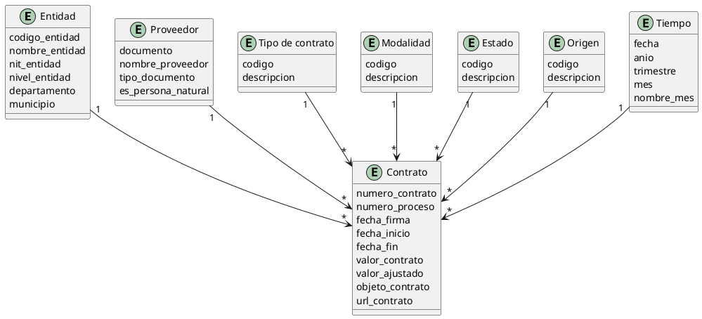
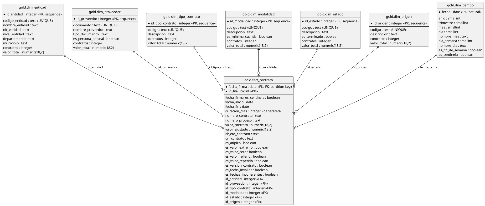

# Modelo relacional — Entregable 2

**Responsable:** Kerin · **Requerimientos:** RF-06 (modelo en estrella con PK y FK), RF-07 a RF-13 (consultas y vistas), RNF-04 (escalabilidad), RNF-05 (fidelidad), RNF-06 (trazabilidad)
**Base de datos:** `secop_dw` · **DDL ejecutable:** [`sql/02_modelo_gold.sql`](../sql/02_modelo_gold.sql)

Este documento describe el modelo **conceptual** (qué información existe y cómo se relaciona, sin importar cómo se almacena) y el **lógico** (tablas, columnas, tipos, claves y restricciones). El modelo físico está en el DDL y este documento lo explica y lo justifica; no lo duplica.

---

## 1. Advertencia sobre las cifras de este documento

Este proyecto tuvo dos cortes de datos y el cambio es importante para leer cualquier número aquí:

| | Corte anterior | **Corte vigente (`secop_dw`)** |
|---|---|---:|
| Base | `secop_integrado` | **`secop_dw`** |
| Filas de origen | 22.670.028 | **16.025.993** |
| Capa intermedia | `silver.contrato` | **`silver.contratos`** |
| Filas tras limpiar | 22.670.028 (fiel al origen) | **13.005.402** (deduplicada) |
| Nombre de la capa cruda | `staging` | **`bronze`** (`bronze.secop_raw`) |

**Consecuencia:** las cardinalidades medidas sobre el corte anterior (sección 7.3) **no son válidas** para el corte vigente, porque el origen cambió y porque la limpieza ahora deduplica. Están marcadas como tales. Las cardinalidades del corte vigente **aún no están medidas** y se marcan como *pendiente* con la consulta exacta que las produce. Preferimos un hueco declarado a un número inventado.

---

## 2. La capa de entrada: qué hereda la capa oro

Oro no transforma nada. Toma `silver.contratos` tal como está y solo reorganiza la información en un modelo en estrella. Lo que oro **no** hace es un trabajo que ya hizo plata, y conviene dejarlo claro porque explica por qué el modelo es tan simple:

| Decisión de plata | Efecto en el modelo de oro |
|---|---|
| Deduplica filas idénticas (13.005.402 desde 16.025.993) | `fact_contrato` tiene una fila por versión, no una por registro bruto |
| Calcula `valor_ajustado` a partir de las versiones de cada contrato | `SUM(valor_ajustado)` es correcto; `SUM(valor_contrato)` está contaminado |
| Normaliza mayúsculas, tildes y barras (35 departamentos, no 38) | Las claves naturales son estables y admiten `UNIQUE` |
| Rechaza fechas imposibles y las deja en `NULL` con bandera | Se necesita un centinela para no perder esas filas (sección 6.3) |
| Marca valores extremos con `flag_valor_atipico` | Todo KPI de dinero filtra `NOT es_atipico` |

Las banderas de calidad **viajan a oro**. Oro no las recalcula ni las descarta: las copia con el prefijo `flag_` eliminado (`es_atipico`, `es_valor_extremo`, `es_valor_cero`, `es_valor_relleno`, `es_valor_repetido`, `es_version_contrato`, `es_fecha_invalida`, `es_fechas_incoherentes`). Un tablero puede entonces filtrar por ellas sin volver a plata.

---

## 3. El grano: la decisión que condiciona todo el modelo

**Una fila de `gold.fact_contrato` = una fila de `silver.contratos` = una versión de contrato.**

No es un contrato, no es un registro del CSV. La distinción importa por dos razones:

1. **SECOP II publica cada modificación como una fila nueva.** Un mismo contrato aparece varias veces con valores distintos, porque cada versión es un acto administrativo distinto. En el corte vigente, **554.063 contratos tienen versiones**; en 4.720 de ellos (0,85%) incluso cambia el número de proceso entre versiones. El grano es la versión.

2. **Por eso `SUM(valor_ajustado)` sí funciona y `SUM(valor_contrato)` no.** `valor_ajustado` se calculó en plata reparando las versiones, de forma que las filas de un contrato suman coherentemente. Sumar el valor crudo sumaría cada versión completa y multiplicaría el dinero.

Si el grano se subiera a "contrato" habría que elegir una fila por contrato (la última, la mayor) y se perdería la historia de las modificaciones, que es justamente lo que pide RF-08. Se documenta como decisión consciente.

---

## 4. Modelo conceptual

### 4.1 Entidades y atributos

**Contrato** (entidad fuerte) — el hecho central.
`fecha_firma`, `fecha_inicio`, `fecha_fin`, `numero_contrato`, `numero_proceso`, `valor_contrato`, `valor_ajustado`, `objeto_contrato`, `url_contrato`, más ocho banderas de calidad.

**Entidad contratante** — quién contrata.
`codigo_entidad`, `nombre_entidad`, `nit_entidad`, `nivel_entidad`, `departamento`, `municipio`.

**Proveedor / contratista** — quién recibe.
`documento`, `nombre_proveedor`, `tipo_documento`, `es_persona_natural`.

**Tipo de contrato** — `codigo`, `descripcion`.
**Modalidad** — `codigo`, `descripcion`.
**Estado del proceso** — `codigo`, `descripcion`.
**Origen del dato** — `codigo`, `descripcion`.
**Tiempo** — `fecha`, `anio`, `trimestre`, `mes`, `dia`, `nombre_mes`, `dia_semana`, `nombre_dia`, `es_fin_de_semana`.

### 4.2 Relaciones

| Desde | Hacia | Cardinalidad | Explicación |
|---|---|---|---|
| Entidad | Contrato | 1 → N | Una entidad contrata muchos contratos |
| Proveedor | Contrato | 1 → N | Un proveedor aparece en muchos contratos |
| Tipo | Contrato | 1 → N | |
| Modalidad | Contrato | 1 → N | |
| Estado | Contrato | 1 → N | |
| Origen | Contrato | 1 → N | |
| Tiempo | Contrato | 1 → N | Una fecha, muchos contratos |

**No existe relación entre las dimensiones.** Ninguna entidad depende de un proveedor, ni un tipo de un estado. Es la propiedad que hace que el modelo sea una estrella y no un grafo: cada dimensión se lee sola, y los KPI se calculan uniendo hechos con la dimensión que interesa. Si dos dimensiones tuvieran relación entre sí, aparecería una arista entre tablas de dimensiones, que es exactamente lo que un modelo en estrella evita.

### 4.3 Diagrama conceptual



### 4.4 Ubicación: atributo, no dimensión

`departamento` y `municipio` están **dentro de `dim_entidad`**, no en una `dim_ubicacion` aparte.

El motivo es la cardinalidad: se midieron **1.131 municipios** y 15.928 entidades. La ubicación es un atributo de la entidad contratante, no una dimensión de primer nivel. Una `dim_ubicacion` aparte habría duplicado el dato sin aportar granularidad nueva, obligado a un `JOIN` extra en cada consulta geográfica (RF-11) y multiplicado por dos el riesgo de que las dos copias se desincronicen.

**Consecuencia asumida:** si el mismo municipio aparece en dos entidades con grafías distintas, la normalización de plata (R1) debe haberlas unificado; el modelo no lo resuelve por sí solo.

---

## 5. Modelo lógico

### 5.1 Diagrama lógico



### 5.2 Tabla de hechos: qué es clave, qué es medida, qué es atributo

La tabla de hechos mezcla tres cosas, y confundirlas es el error clásico del modelo en estrella:

| Categoría | Columnas | Cómo se usa |
|---|---|---|
| **Claves** | `fecha_firma` + `id_fila` (PK compuesta), las 6 FK | Unen el hecho con las dimensiones. No se agregan. |
| **Medidas** | `valor_contrato`, `valor_ajustado` | Se suman. `valor_ajustado` es la única usada en KPI. |
| **Atributos del hecho** | `numero_contrato`, `objeto_contrato`, banderas, `duracion_dias` | Describen **esta** versión del contrato. No se agregan; se cuentan o se filtran. |

`objeto_contrato` es un atributo del hecho y **no** una dimensión: es texto libre, con miles de valores distintos. Ponerlo en una dimensión obligaría a un `JOIN` por cada contrato y no aportaría ningún agrupamiento útil.

### 5.3 Deriva

`duracion_dias` es `GENERATED ALWAYS AS (fecha_fin - fecha_inicio) STORED`. Es una resta de dos columnas que RF-09 lee en todos sus percentiles; materializarla evita 13 millones de restas por consulta.

El `DEFAULT false` de las banderas y de `es_minima_cuantia` / `es_terminado` existe por un motivo concreto: el `INSERT` de carga usa `coalesce()` sobre banderas que en plata pueden venir nulas, y una columna `NOT NULL` sin default rompe la carga si alguna vez llega un nulo.

---

## 6. Normalización

### 6.1 Primera forma normal

Satisfied por construcción, y con una aclaración que suele pasarse por alto: **1FN exige que no haya grupos repetidos**, no solo que las celdas sean atómicas.

El origen **sí** tenía grupos repetidos, de hecho físico: un registro traía nombre de entidad, NIT, departamento y municipio en la misma fila, y esos valores se repetían en las miles de filas de esa entidad. Oro los extrae a `dim_entidad`, y cada fila de hechos guarda solo un entero.

En `dim_proveedor`, el `tipo_documento` y el nombre están juntos porque **ambos dependen del documento completo**, que es la clave natural de la tabla. No es una anomalía. La tabla tiene dos claves: la primaria `id_proveedor`, que es la surrogate key, y la `UNIQUE (documento)`, que es su clave natural y por la que se une la tabla de hechos. `tipo_documento` es un atributo descriptor del mismo documento, no parte de la clave.

### 6.2 Segunda y tercera forma normal

Oro cumple 3FN, con dos puntos que conviene examinar aparte porque son los que se suelen atacar:

- **Claves candidatas.** Cada dimensión categórica tiene una clave natural con `UNIQUE` (`codigo_entidad`, `documento`, `codigo`, …). La clave primaria sigue siendo la sustituta, por lo que el modelo cumple 3FN de hecho, no por Conveniencia: **ninguna decisión de modelado depende de que los datos estén limpios.**
- **Dependencias transitivas.** En `dim_entidad`, `nombre_entidad`, `nit_entidad`, `departamento` y `municipio` dependen de `codigo_entidad`, que es clave de la tabla. No dependen de `id_entidad` ni entre sí, así que no hay dependencia transitiva.
- **Dependencias parciales.** No hay ninguna: toda columna no clave depende de la clave completa.

La normalización llega a 3FN pero no a BCN de forma total, y es una decisión: en `dim_tipo_contrato`, `codigo` y `descripcion` son sinónimos en la práctica (el código es el texto). BCN pediría separarlos. No se separan porque no hay violación real —depender del código es depender de la clave— y separar añadiría una tabla sin eliminar ninguna anomalía.

### 6.3 Desnormalización deliberada: `contratos` y `valor_total`

Las seis dimensiones categóricas llevan dos columnas agregadas: `contratos` (entero) y `valor_total` (`numeric(18,2)`), con `valor_total` calculado sobre `valor_ajustado` excluyendo `es_atipico`.

Esto **rompe 3NF a propósito**: `valor_total` es derivable de los hechos, y mantenerlo en la dimensión es una duplicación que puede quedar desactualizada.

El motivo es de consumo, no de corrección. La alternativa a calcularla en cada consulta es un `SUM` sobre 13 millones de filas **por cada tarjeta de un tablero**, y los tableros de RF-15 a RF-18 muestran una tarjeta por entidad, por proveedor y por modalidad. El ahorro no es hipotético.

Cómo se evita que se desactualice: las columnas se recalculan con seis `UPDATE` que corren en cada ejecución de la carga, inmediatamente antes de insertar los hechos. No se recalculan "a mano" ni se mantienen entre ejecuciones. Si se modificara un hecho sin pasar por la carga, ambas quedarían desincronizadas; por eso el DDL **no expone estas columnas como editables** y por eso los hechos no se corrigen en sitio.

> **No hay transacción alrededor de la carga, y es deliberado.** Los seis `UPDATE` y el `INSERT` de hechos son sentencias sueltas: `psql` corre cada una en autocommit. Envolver 13 millones de filas en una sola transacción exigiría sostener el WAL y el visibilidad de snapshots de todo el lote en memoria, que es justo lo que este clúster no tiene (8 GB en `shared_buffers`). El costo de esa decisión es acotado y conocido: si el `INSERT` de hechos fallara a mitad de camino, los agregados de las dimensiones ya quedaron confirmados y corresponderían a los lotes cargados hasta ese punto. Se corrige relanzando la carga, que es idempotente para las dimensiones y hay que volver a tirar para los hechos. Es preferible a un OOM a mitad del proceso.

`duracion_dias` es el mismo tipo de decisión, pero más barata: no necesita `JOIN`, se materializa sola y por eso sí es `GENERATED`.

### 6.4 Dimensión que no usa llave sustituta: `dim_tiempo`

De las siete dimensiones, **`dim_tiempo` es la única cuya clave primaria es natural** (`fecha`). Las otras seis usan `id` incremental más clave natural con `UNIQUE`. También es la única que **no tiene registro `-1`**.

Es una desviación consciente de la especificación original, que pedía siete dimensiones con llave sustituta y registro desconocido. El motivo está en una restricción de PostgreSQL:

`fecha_firma` es **clave de partición** de `fact_contrato`. PostgreSQL exige que la clave de partición sea una columna o expresión **de la propia tabla**, nunca una referencia a otra tabla. Si `dim_tiempo` tuviera `id_tiempo`, la FK sería `id_tiempo → id_tiempo` y habría que **duplicar la fecha en la tabla de hechos**, guardarla dos veces, y perder la garantía de que ambas copias coinciden.

El `-1` tampoco aporta nada aquí. En las otras seis dimensiones, `-1` responde a *"no sé qué valor es"*. En el calendario la ausencia de fecha **ya tiene un valor propio y explícito**: `1900-01-01`, con su bandera `es_centinela`. El `-1` sería un segundo símbolo para la misma idea, y usar los dos sería peor que usar uno.

### 6.5 El registro `-1`: miembro desconocido

Las seis dimensiones categóricas tienen un registro con `id = -1` y `codigo = 'NO DEFINIDO'`. No es un dato: es la representación de "esta fila no tiene valor en esta dimensión".

Existe por tres razones que se refuerzan:

1. Las seis FK de `fact_contrato` son `NOT NULL`. Sin `-1`, la carga fallaría en la primera fila sin categoría.
2. Evita la ambigüedad de `LEFT JOIN` + `COALESCE` en cada consulta.
3. Hace visible el vacío en los tableros. Contar filas con `id_entidad = -1` responde *"¿cuántos contratos no tienen entidad contratante?"*, que es una pregunta de calidad de datos, y se responde con un `WHERE`, no reescribiendo la agregación.

El `-1` **no se excluye de los agregados**: si se excluyera, el número de contratos de un tablero no cuadraría con el número de filas de plata. Se excluye solo cuando la pregunta es sobre entidades o proveedores, que es donde el desconocido no aporta.

---

## 7. Cardinalidades

### 7.1 Cómo leer las cifras

| Marca | Significado |
|---|---|
| **medido** | Salió de una consulta sobre el corte indicado |
| **proyectado** | Estimación a partir del corte anterior |
| **pendiente** | No medido todavía; se indica la consulta |

### 7.2 Estado actual

**Las cardinalidades del corte vigente `secop_dw` no están medidas.** No se reportan aquí porque no se han ejecutado consultas contra `silver.contratos` en este corte, y estimarlas a partir del corte anterior (que además tiene el doble de filas y no estaba deduplicado) produciría cifras plausible e incorrectas.

El bloque 9 del DDL las produce automáticamente: la consulta **9.2** da el conteo real de filas y tamaño de cada tabla de oro, y las **9.8** dan cuántas filas caen en cada `-1`. Con esa salida, esta sección se completa con números medidos.

### 7.3 Lo que sí sabemos, y de dónde viene

**Estructural, sin depender de los datos:**

| Objeto | Cardinalidad |
|---|---:|
| `dim_tiempo` | **47.847** días exactos (1900-01-01 a 2030-12-31) |
| `dim_tipo_contrato`, `dim_modalidad`, `dim_estado`, `dim_origen` | Valores muy bajos, contados en QA |
| Membresía `-1` en cada dimensión | Exactamente 1 fila, por construcción |
| Particiones de `fact_contrato` | 13 (11 anuales 2017-2027, 1 cuarentena pre-2000, 1 por defecto) |

**Del corte anterior de 22.670.028 filas — válido como referencia histórica, no como medida actual:**

| Dimensión | Cardinalidad | Medición |
|---|---:|---|
| Entidades | 15.928 | medida |
| Proveedores | 2.508.996 | medida |
| Municipios | 1.131 | medida |
| Departamentos | 35 (33 reales + `No Definido` + inválido `Colombia`) | medida, sobre 38 valores crudos |
| Orígenes | 2 | medida |
| Tipos de contrato | 34 | medida |
| Modalidades | 15 | medida |

**Lo que sí sabemos del corte vigente y es medido:**

| Dato | Valor |
|---|---:|
| Filas en `bronze.secop_raw` | 16.025.993 |
| Filas en `silver.contratos` | 13.005.402 |
| Validación de plata | 42/42 pruebas OK |
| Valores marcados `flag_valor_atipico` | 33.928 |

---

## 8. Modelo físico: particionado e índices

Detalle en [`decisiones_tecnicas.md`](decisiones_tecnicas.md) y en los comentarios del DDL. Resumen:

- **`fact_contrato` está particionada por rango de `fecha_firma`**: 11 particiones anuales (2017-2027), 1 cuarentena `pre2000` (que Concentra todo el centinela) y 1 partición por defecto.
- **La PK es compuesta** `(fecha_firma, id_fila)` porque PostgreSQL no admite una PK ni un `UNIQUE` que no incluya la clave de partición. Efecto lateral útil: los rangos de fecha quedan cubiertos, así que no hace falta un B-tree extra sobre `fecha_firma`.
- **BRIN sobre `fecha_firma`**, no B-tree. El orden de carga es por año, así que las páginas físicas ya están ordenadas y el BRIN cumple por menos de 1% de su tamaño.

---

## 9. Trazabilidad (RNF-06)

`fact_contrato.id_fila` es **la misma clave** que `silver.contratos.id_fila` y que `bronze.secop_raw.id_fila`. Oro no genera una identidad nueva. La ruta completa de una cifra es:

```sql
SELECT ... FROM gold.fact_contrato f
JOIN silver.contratos  s USING (id_fila)
JOIN bronze.secop_raw  b USING (id_fila);
```

**El precio, que hay que conocer:** la trazabilidad ata el `id` al orden de carga de bronce. Si bronce se recarga con otro orden, hay que reconstruir oro. Es un intercambio consciente y el propio DDL lo documenta.

Es también la razón por la que oro **no** guarda `fecha_firma_original`. En el modelo anterior, plata conservaba el texto crudo de la fecha y oro podía duplicarlo. En `secop_dw`, R4 puso la fecha rechazada en `NULL` y solo dejó la bandera: **el original ya no está en plata**, así que una columna con ese nombre en oro guardaría una copia de `fecha_firma` (52 MB) sin recuperar nada. El original vive en bronce, al que se llega por `id_fila`.

---

## 10. Vistas de consumo (RF-13)

| Vista | Para qué | Filtra |
|---|---|---|
| `gold.v_contratos` | Auditoría y QA. Todos los contratos con las banderas a la vista. | Nada |
| `gold.v_contratos_validos` | **Origen único de Power BI.** | `NOT es_atipico AND NOT es_fecha_invalida` |

**Por qué el filtro vive en la vista y no en el tablero.** Un filtro en Power BI es una opción que se puede desactivar con un clic. En un tablero que se presenta a un externo, esa es la única protección que separa el número que se publica del número que es un error del dato. Si la vista ya viene filtrada, el tablero no puede mostrar un total contaminado por ningún camino.

---

## 11. Verificación

El bloque 9 del DDL ejecuta once comprobaciones. Las cuatro que de verdad detectan un modelo mal construido:

| # | Comprobación | Valor esperado | Qué detecta |
|---|---|---|---|
| 9.5 | Huérfanos por FK (7 conteos) | 0 en todos | Un hecho apuntando a una dimensión inexistente |
| 9.6 | `silver.contratos` − `fact_contrato` | 0 | Grano perdido o duplicado en la carga |
| 9.7 | `(fecha_firma, id_fila)` duplicados | 0 | Carga repetida |
| 9.9 | Dinero por año | Cercano a ~100 billones en 2018 | Medidas mal filtradas |

La 9.9 es la que importa. Un modelo perfectamente normalizado que sume mal es peor que un modelo mal normalizado que al menos se ve raro: el primero se descubre en una auditoría.

---

## 12. Trazabilidad de requisitos

| Requisito | Dónde se cumple |
|---|---|
| RF-06 · Modelo en estrella con PK y FK | Secciones 4-6, DDL completo |
| RF-07 · Concentración de mercado | `dim_proveedor`, `dim_entidad` |
| RF-08 · Fraccionamiento de contratos | Grano por versión (sección 3), `es_version_contrato` |
| RF-09 · Tiempos de ejecución | `duracion_dias`, `dim_tiempo`, `es_fechas_incoherentes` |
| RF-10 · Evolución temporal | `dim_tiempo`, `dim_modalidad`, `dim_tipo_contrato` |
| RF-11 · Análisis geográfico | `departamento`, `municipio` en `dim_entidad` |
| RF-12 · Perfil de contratistas | `tipo_documento`, `es_persona_natural` |
| RF-13 · Vistas reutilizables | `v_contratos`, `v_contratos_validos` |
| RNF-04 · Escalabilidad | Particionado e índices (sección 8) |
| RNF-05 · Fidelidad | `valor_contrato` se conserva; `valor_ajustado` es la medida |
| RNF-06 · Trazabilidad | `id_fila` heredado (sección 9) |

---

## 13. Desviaciones respecto a la especificación

Se documentan aquí para que la revisión las encuentre, no para justificarlas con posteriori.

| # | Especificación | Modelo | Motivo |
|---|---|---|---|
| 1 | 9 dimensiones | 7 (+1 tabla de hechos) | `dim_ubicacion` eliminada: la ubicación es atributo de la entidad (sección 4.4) |
| 2 | 7 dimensiones con llave sustituta | 6 con `id`; `dim_tiempo` con clave natural | Restricción de partición de PostgreSQL (sección 6.4) |
| 3 | Registro `-1` en las 7 | 6 registros `-1`; `dim_tiempo` usa el centinela `1900-01-01` | El calendario tiene un valor explícito para la ausencia de fecha (sección 6.4) |
| 4 | Grano por contrato | Grano por versión de contrato | SECOP II publica cada modificación como fila; conservarlo es lo que pide RF-08 (sección 3) |

---

## 14. Cómo reproducir este modelo

```bash
# Base de datos objetivo
PGDATABASE=secop_dw

# Crear el modelo (idempotente: solo crea lo que falta)
psql -f sql/02_modelo_gold.sql

# Reconstruir oro desde cero, sin tocar bronce ni plata
psql -v recrear=1 -f sql/02_modelo_gold.sql
```

Silver debe estar cargada y validada antes: el DDL lee `silver.contratos` y falla si no existe.

---

## 15. Referencias

| Documento | Contenido |
|---|---|
| [`sql/02_modelo_gold.sql`](../sql/02_modelo_gold.sql) | DDL ejecutable: tablas, claves, índices, particiones, carga, vistas, verificación |
| [`decisiones_tecnicas.md`](decisiones_tecnicas.md) | Decisiones de diseño con alternativas descartadas |
| [`volumetria.md`](volumetria.md) | Volumetría medida |
| [`requerimientos.md`](requerimientos.md) | RF-01 a RF-20, RNF-01 a RNF-10 |
| [`Plan_Entrega.md`](Plan_Entrega.md) | Responsables, ruta y estados |
| `sql/ETL/02_silver_limpieza.sql` | Definición y reglas de limpieza de `silver.contratos` |
| `sql/ETL/02c_correccion_valores.sql` | `valor_ajustado`, versiones y valores extremos |
| `sql/ETL/05_qa_silver.sql` | 42 pruebas de calidad de plata |